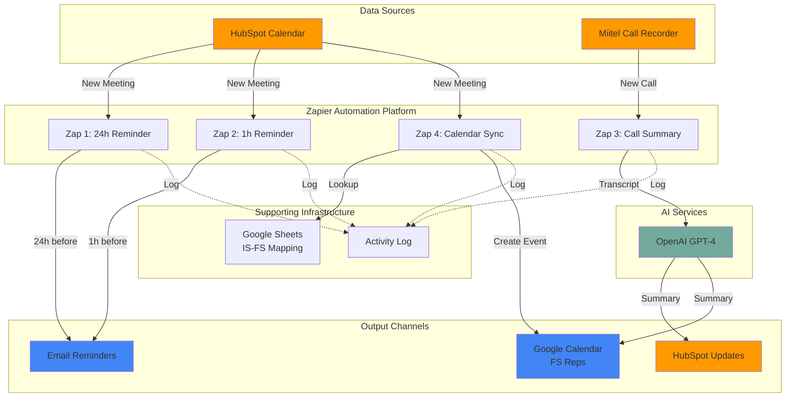
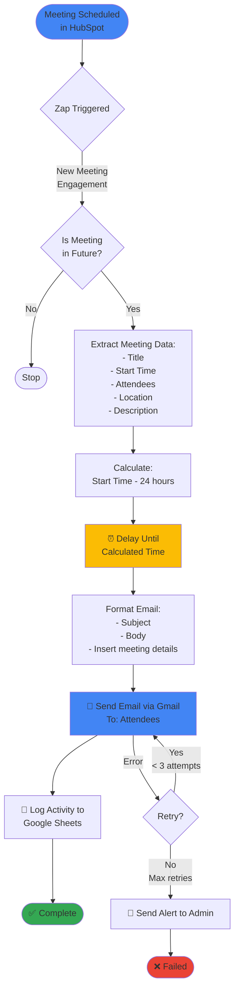
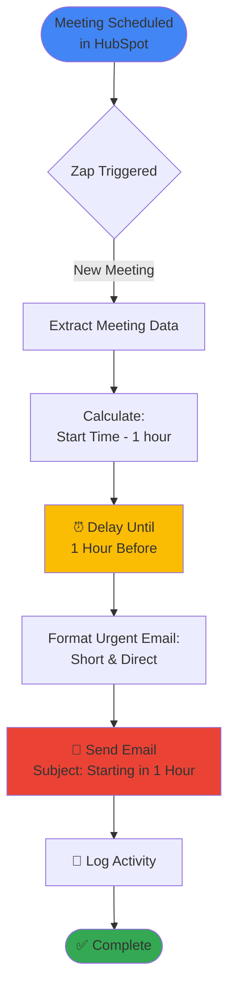
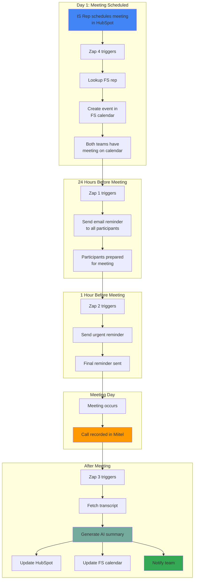
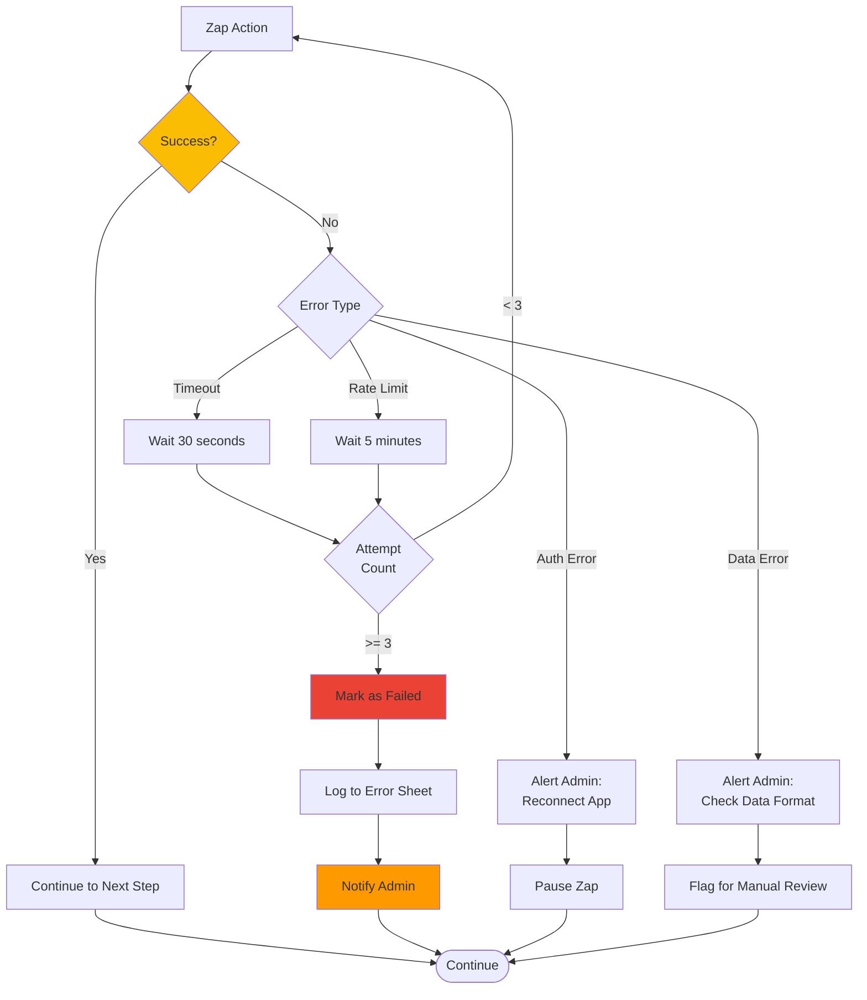

# Zapier Automation Workflows - Flowcharts
## Internal Sales Automation Plan

**Version:** 1.0
**Last Updated:** October 30, 2025

---

## Table of Contents

1. [System Architecture Overview](#system-architecture-overview)
2. [Workflow 1: Meeting Reminder - 24 Hours](#workflow-1-meeting-reminder---24-hours)
3. [Workflow 2: Meeting Reminder - 1 Hour](#workflow-2-meeting-reminder---1-hour)
4. [Workflow 3: Call Summary Automation](#workflow-3-call-summary-automation)
5. [Workflow 4: FS Calendar Sync](#workflow-4-fs-calendar-sync)
6. [Complete System Integration](#complete-system-integration)

---

## System Architecture Overview

### High-Level Architecture



### ASCII Version (For Non-Markdown Viewers)

```
┌─────────────────────────────────────────────────────────────────┐
│                    DATA SOURCES                                  │
│  ┌─────────────────┐           ┌──────────────────┐            │
│  │ HubSpot Calendar│           │  Miitel Recorder │            │
│  └────────┬────────┘           └────────┬─────────┘            │
└───────────┼─────────────────────────────┼──────────────────────┘
            │                             │
            ▼                             ▼
┌─────────────────────────────────────────────────────────────────┐
│              ZAPIER AUTOMATION PLATFORM                          │
│                                                                   │
│  ┌─────────┐  ┌─────────┐  ┌──────────┐  ┌──────────┐         │
│  │ Zap 1   │  │ Zap 2   │  │  Zap 3   │  │  Zap 4   │         │
│  │ 24h     │  │ 1h      │  │  Call    │  │ Calendar │         │
│  │Reminder │  │Reminder │  │ Summary  │  │  Sync    │         │
│  └────┬────┘  └────┬────┘  └────┬─────┘  └────┬─────┘         │
└───────┼────────────┼────────────┼─────────────┼────────────────┘
        │            │            │             │
        │            │            ├──►[OpenAI GPT-4]
        │            │            │             │
        ▼            ▼            ▼             ▼
┌─────────────────────────────────────────────────────────────────┐
│                     OUTPUT CHANNELS                              │
│  ┌──────────┐  ┌─────────────┐  ┌──────────────┐              │
│  │  Email   │  │   Google    │  │   HubSpot    │              │
│  │Reminders │  │  Calendar   │  │   Updates    │              │
│  └──────────┘  └─────────────┘  └──────────────┘              │
└─────────────────────────────────────────────────────────────────┘
```

---

## Workflow 1: Meeting Reminder - 24 Hours

### Purpose
Automatically send email reminders 24 hours before scheduled meetings.

### Flowchart



### Step-by-Step Process

```
STEP 1: TRIGGER
├─ Event: New Meeting Engagement in HubSpot
├─ Type: Meeting
└─ Action: Start Zap

STEP 2: FILTER (Optional)
├─ Check: Meeting Start Time > Current Time
├─ If True: Continue
└─ If False: Stop

STEP 3: EXTRACT DATA
├─ Meeting Title
├─ Start Date & Time
├─ End Date & Time
├─ Attendee Names
├─ Attendee Emails
├─ Location/Meeting Link
├─ Description/Agenda
└─ Owner Name

STEP 4: CALCULATE DELAY
├─ Formula: Start Time - 24 hours
└─ Example: Meeting at 2pm Tuesday → Reminder at 2pm Monday

STEP 5: DELAY
├─ Wait until calculated time
└─ Status: Scheduled

STEP 6: FORMAT EMAIL
├─ Subject: "Reminder: Meeting Tomorrow - {Title}"
├─ Body: Include all meeting details
└─ From: Internal Sales Team

STEP 7: SEND EMAIL
├─ Service: Gmail
├─ To: All attendees
├─ CC: Meeting owner (optional)
└─ Status: Sent

STEP 8: LOG ACTIVITY
├─ Timestamp: Current time
├─ Zap Name: Meeting Reminder - 24h
├─ Action: Email Sent
├─ Meeting: {Title}
└─ Recipient: {Email}

STEP 9: COMPLETE
└─ Status: Success ✓
```

### Data Flow Diagram

```
┌──────────────────┐
│   HubSpot API    │
│  Meeting Created │
└────────┬─────────┘
         │
         ├─► Meeting ID: 12345
         ├─► Title: "Q4 Strategy Meeting"
         ├─► Start: 2025-11-05 14:00:00
         ├─► Attendees: john@company.com, jane@company.com
         ├─► Location: Conference Room A
         └─► Description: "Discuss Q4 goals"
         │
         ▼
┌──────────────────┐
│  Zapier Filter   │
│  Future Meeting? │
└────────┬─────────┘
         │ [YES]
         ▼
┌──────────────────┐
│  Delay Calculator│
│  2025-11-04 14:00│ ◄─── 24 hours before
└────────┬─────────┘
         │
         ▼
┌──────────────────┐
│  Gmail Composer  │
│                  │
│  To: john@...    │
│  Subject: Rem... │
│  Body: Hi John...│
└────────┬─────────┘
         │
         ▼
┌──────────────────┐
│   Email Sent ✓   │
└──────────────────┘
```

---

## Workflow 2: Meeting Reminder - 1 Hour

### Purpose
Send urgent reminder 1 hour before meeting starts.

### Flowchart



### Key Differences from 24h Reminder

```
┌─────────────────────┬─────────────────────┬─────────────────────┐
│     Feature         │   24-Hour Reminder  │   1-Hour Reminder   │
├─────────────────────┼─────────────────────┼─────────────────────┤
│ Timing              │ 24 hours before     │ 1 hour before       │
│ Email Tone          │ Informative         │ Urgent              │
│ Email Length        │ Detailed            │ Brief               │
│ Subject             │ "Tomorrow"          │ "Starting in 1h"    │
│ Include Agenda      │ Yes                 │ No (link only)      │
│ Priority            │ Normal              │ High                │
└─────────────────────┴─────────────────────┴─────────────────────┘
```

### Simplified Flow

```
Meeting → Wait 1 Hour Before → Send Brief Email → Log → Done
   │           │                      │              │
   │           │                      │              └─► Activity Log
   │           │                      └─► "Starting in 1 hour!"
   │           └─► Shorter wait time
   └─► Same trigger as 24h reminder
```

---

## Workflow 3: Call Summary Automation

### Purpose
Automatically generate AI-powered summaries from call transcripts and update systems.

### Complete Flowchart

```mermaid
graph TD
    Start([Call Completed<br/>in Miitel]) --> Trigger{Trigger Method}

    Trigger -->|Option A| Webhook[Webhook: Call Completed]
    Trigger -->|Option B| Email[Email: New Recording]
    Trigger -->|Option C| Schedule[Scheduled: Every 15 min]

    Webhook --> FetchID[Extract Call ID]
    Email --> FetchID
    Schedule --> FetchID

    FetchID --> API[📞 API Call to Miitel:<br/>GET /transcripts/{id}]

    API --> Check{Transcript<br/>Available?}
    Check -->|No| Retry[Wait 2 minutes]
    Retry --> API
    Check -->|Yes| Parse[Parse Transcript:<br/>Extract text content]

    Parse --> Type{Call Type}
    Type -->|Discovery| PromptD[Use Discovery Prompt]
    Type -->|Demo| PromptDemo[Use Demo Prompt]
    Type -->|Follow-up| PromptF[Use Follow-up Prompt]

    PromptD --> AI[🤖 OpenAI GPT-4<br/>Generate Summary]
    PromptDemo --> AI
    PromptF --> AI

    AI --> Parse2[Parse AI Response:<br/>Extract JSON]

    Parse2 --> Valid{Valid<br/>JSON?}
    Valid -->|No| Manual[Flag for Manual Review]
    Valid -->|Yes| Struct[Structure Data:<br/>- Key Points<br/>- Next Steps<br/>- Sentiment]

    Struct --> Split{Update Destinations}

    Split -->|Path 1| HubSpot[📝 Update HubSpot:<br/>Contact/Deal Notes]
    Split -->|Path 2| Calendar[📅 Update Google Calendar:<br/>Add summary to event]
    Split -->|Path 3| Notify[📧 Notify IS Team Member]

    HubSpot --> Log[📊 Log Activity]
    Calendar --> Log
    Notify --> Log
    Manual --> Log

    Log --> End([✅ Complete])

    AI -->|Error| ErrorAI[🚨 AI Error]
    ErrorAI --> RetryAI{Retry?}
    RetryAI -->|Yes| AI
    RetryAI -->|No| Manual

    style Start fill:#ff9900
    style AI fill:#74aa9c
    style End fill:#34a853
    style Manual fill:#fbbc04
    style ErrorAI fill:#ea4335
```

### Detailed Process Flow

```
┌────────────────────────────────────────────────────────────────┐
│ PHASE 1: CALL DETECTION                                        │
├────────────────────────────────────────────────────────────────┤
│                                                                 │
│  [Option A: Webhook]                                           │
│  Miitel → Webhook URL → Zapier (Instant)                       │
│                                                                 │
│  [Option B: Email Parsing]                                     │
│  Miitel → Email → Zapier → Parse Call ID                       │
│                                                                 │
│  [Option C: Scheduled Polling]                                 │
│  Zapier → Every 15 min → Check Miitel API                      │
│                                                                 │
└────────────────────────────────────────────────────────────────┘
         │
         ▼
┌────────────────────────────────────────────────────────────────┐
│ PHASE 2: TRANSCRIPT RETRIEVAL                                  │
├────────────────────────────────────────────────────────────────┤
│                                                                 │
│  1. Extract Call ID from trigger                               │
│  2. Call Miitel API: GET /transcripts/{call_id}                │
│  3. Verify transcript is complete                              │
│  4. Extract transcript text                                    │
│                                                                 │
│  Data Retrieved:                                               │
│  ├─ Call ID                                                    │
│  ├─ Transcript Text (full)                                     │
│  ├─ Call Duration                                              │
│  ├─ Participants                                               │
│  ├─ Date/Time                                                  │
│  └─ Customer Name/Company                                      │
│                                                                 │
└────────────────────────────────────────────────────────────────┘
         │
         ▼
┌────────────────────────────────────────────────────────────────┐
│ PHASE 3: AI PROCESSING                                         │
├────────────────────────────────────────────────────────────────┤
│                                                                 │
│  1. Determine Call Type (Discovery/Demo/Follow-up)             │
│  2. Select appropriate prompt template                         │
│  3. Send to OpenAI GPT-4:                                      │
│     ┌──────────────────────────────────┐                      │
│     │ Prompt: "Analyze this sales call│                      │
│     │ transcript and provide..."       │                      │
│     │                                  │                      │
│     │ Transcript: {full_text}          │                      │
│     └──────────────────────────────────┘                      │
│                                                                 │
│  4. Receive AI Response (JSON format)                          │
│  5. Parse JSON to extract:                                     │
│     ├─ Key Points: ["point 1", "point 2", ...]                │
│     ├─ Next Steps: ["action 1", "action 2", ...]              │
│     ├─ Sentiment: "positive" | "neutral" | "negative"         │
│     └─ Summary: "Brief 2-3 sentence summary"                   │
│                                                                 │
└────────────────────────────────────────────────────────────────┘
         │
         ▼
┌────────────────────────────────────────────────────────────────┐
│ PHASE 4: DISTRIBUTION                                          │
├────────────────────────────────────────────────────────────────┤
│                                                                 │
│  Path A: Update HubSpot                                        │
│  ├─ Find Contact/Deal                                          │
│  ├─ Add note with summary                                      │
│  └─ Update custom fields                                       │
│                                                                 │
│  Path B: Update Google Calendar                                │
│  ├─ Lookup IS→FS mapping                                       │
│  ├─ Find calendar event                                        │
│  └─ Append summary to event description                        │
│                                                                 │
│  Path C: Notify Team                                           │
│  ├─ Send email to IS rep                                       │
│  └─ Include summary link                                       │
│                                                                 │
└────────────────────────────────────────────────────────────────┘
         │
         ▼
┌────────────────────────────────────────────────────────────────┐
│ PHASE 5: LOGGING & COMPLETION                                  │
├────────────────────────────────────────────────────────────────┤
│                                                                 │
│  Log to Activity Sheet:                                        │
│  ├─ Timestamp                                                  │
│  ├─ Call ID                                                    │
│  ├─ Summary generated                                          │
│  ├─ Systems updated                                            │
│  └─ Status: Success/Failed                                     │
│                                                                 │
│  ✅ COMPLETE                                                    │
│                                                                 │
└────────────────────────────────────────────────────────────────┘
```

### AI Prompt Flow

```
┌─────────────────────────────────────────────────────────────────┐
│                      AI PROMPT TEMPLATES                         │
├─────────────────────────────────────────────────────────────────┤
│                                                                  │
│  [Discovery Call]                                               │
│  "You are a sales assistant. Analyze this discovery call        │
│   and identify:                                                 │
│   1. Customer pain points                                       │
│   2. Discussed solutions                                        │
│   3. Budget/timeline                                            │
│   4. Next steps                                                 │
│   5. Overall sentiment"                                         │
│                                                                  │
│  [Product Demo]                                                 │
│  "Analyze this demo call and identify:                          │
│   1. Features demonstrated                                      │
│   2. Customer questions                                         │
│   3. Objections raised                                          │
│   4. Interest level                                             │
│   5. Next steps"                                                │
│                                                                  │
│  [Follow-up Call]                                               │
│  "Analyze this follow-up and identify:                          │
│   1. Progress since last call                                   │
│   2. Remaining concerns                                         │
│   3. Decision timeline                                          │
│   4. Next steps                                                 │
│   5. Deal probability"                                          │
│                                                                  │
└─────────────────────────────────────────────────────────────────┘
         │
         ▼
┌─────────────────────────────────────────────────────────────────┐
│                    AI RESPONSE FORMAT                            │
├─────────────────────────────────────────────────────────────────┤
│  {                                                               │
│    "keyPoints": [                                               │
│      "Customer needs CRM integration",                          │
│      "Budget approved for $50K",                                │
│      "Decision timeline: End of Q4"                             │
│    ],                                                           │
│    "nextSteps": [                                               │
│      "Send proposal by Friday",                                 │
│      "Schedule technical demo",                                 │
│      "Connect with IT team"                                     │
│    ],                                                           │
│    "sentiment": "positive",                                     │
│    "summary": "Productive call with ABC Corp. They're          │
│                interested in our CRM integration. Budget        │
│                approved, looking to decide by end of Q4."       │
│  }                                                              │
└─────────────────────────────────────────────────────────────────┘
```

---

## Workflow 4: FS Calendar Sync

### Purpose
Automatically sync HubSpot meetings to Field Sales representatives' Google Calendars.

### Flowchart

```mermaid
graph TD
    Start([Meeting Scheduled<br/>in HubSpot]) --> Trigger[Zap Triggered:<br/>New Engagement]

    Trigger --> Extract[Extract Data:<br/>- Meeting details<br/>- IS Owner email<br/>- Customer info]

    Extract --> Lookup[📊 Lookup in Google Sheet:<br/>IS-FS-Team-Mapping]

    Lookup --> Match{IS Member<br/>Found?}

    Match -->|No| Alert1[🚨 Alert: No FS rep mapped]
    Match -->|Yes| GetFS[Get FS Rep Info:<br/>- FS Rep Email<br/>- Calendar ID]

    GetFS --> Format[Format Event:<br/>- Title: [Customer Meeting]<br/>- Description: Include details<br/>- Attendees: FS rep + Customer]

    Format --> Create[📅 Create Event in<br/>FS Rep's Google Calendar]

    Create --> Success{Event<br/>Created?}

    Success -->|No| Retry{Retry?}
    Retry -->|Yes| Create
    Retry -->|No| Alert2[🚨 Alert: Calendar error]

    Success -->|Yes| Update[Update HubSpot:<br/>Add calendar link to notes]

    Update --> Log[📝 Log Activity]

    Log --> End([✅ Complete])
    Alert1 --> End2([⚠️ Partial Success])
    Alert2 --> End2

    style Start fill:#4285f4
    style End fill:#34a853
    style End2 fill:#fbbc04
    style Lookup fill:#ff9900
    style Create fill:#34a853
```

### IS-FS Mapping Flow

```
┌────────────────────────────────────────────────────────────────┐
│                  IS-FS TEAM MAPPING LOGIC                       │
├────────────────────────────────────────────────────────────────┤
│                                                                 │
│  STEP 1: Meeting Created in HubSpot                            │
│  ├─ Meeting Owner: john.doe@company.com (IS Rep)               │
│  └─ Need to find assigned FS Rep                               │
│                                                                 │
│  STEP 2: Lookup in Google Sheet                                │
│  ┌─────────────────────────────────────────────────────┐      │
│  │ IS Member Email      │ FS Rep Email      │ Calendar │      │
│  ├─────────────────────────────────────────────────────┤      │
│  │ john.doe@company.com │ jane@company.com  │ jane@... │      │
│  │ sarah@company.com    │ mike@company.com  │ mike@... │      │
│  └─────────────────────────────────────────────────────┘      │
│                  ▲                                              │
│                  │ Find matching row                           │
│                  │                                              │
│  STEP 3: Extract FS Rep Info                                   │
│  ├─ FS Rep: jane@company.com                                   │
│  └─ Calendar ID: jane@company.com                              │
│                                                                 │
│  STEP 4: Use for Calendar Event Creation                       │
│  └─ Create event in jane@company.com's calendar                │
│                                                                 │
└────────────────────────────────────────────────────────────────┘
```

### Calendar Event Creation

```
INPUT from HubSpot:
├─ Meeting Title: "Q4 Strategy Discussion"
├─ Customer: "Acme Corp"
├─ Contact: "Bob Smith"
├─ Start: 2025-11-05 14:00
├─ End: 2025-11-05 15:00
├─ Location: "Zoom Link"
└─ Description: "Discuss implementation timeline"

        ↓ Transform ↓

OUTPUT to Google Calendar:
┌─────────────────────────────────────────────────────────┐
│ Event Title: [Customer Meeting] Q4 Strategy Discussion  │
├─────────────────────────────────────────────────────────┤
│ When: Tuesday, Nov 5, 2025                              │
│       2:00 PM - 3:00 PM                                 │
├─────────────────────────────────────────────────────────┤
│ Where: Zoom Link                                        │
├─────────────────────────────────────────────────────────┤
│ Guests:                                                 │
│  - jane@company.com (FS Rep)                            │
│  - bob@acmecorp.com (Customer)                          │
├─────────────────────────────────────────────────────────┤
│ Description:                                            │
│                                                         │
│ Customer: Acme Corp                                     │
│ Contact: Bob Smith                                      │
│ IS Rep: John Doe                                        │
│                                                         │
│ Agenda:                                                 │
│ Discuss implementation timeline                         │
│                                                         │
│ HubSpot Link: [Link to meeting in HubSpot]            │
└─────────────────────────────────────────────────────────┘

        ↓ Created ↓

RESULT:
✅ Event appears in FS Rep's calendar
✅ FS Rep receives notification
✅ Customer receives invite
✅ HubSpot updated with calendar link
```

---

## Complete System Integration

### End-to-End Process Flow



### Timeline Visualization

```
TIME BEFORE MEETING        ACTION                           SYSTEM
─────────────────────────────────────────────────────────────────────

Day -1, 14:00          Meeting Scheduled              HubSpot
       │                      │
       ├─────────────────► Zap 4 Triggers             Zapier
       │                      │
       │               FS Calendar Updated         Google Calendar
       │                      │
       │                      ▼
Day 0, 14:00 (24h)     Zap 1 Triggers                 Zapier
  -24:00:00                   │
       │               24-Hour Reminder Sent          Gmail
       │                      │
       │                      ▼
Day 1, 13:00 (1h)      Zap 2 Triggers                 Zapier
  -01:00:00                   │
       │               1-Hour Reminder Sent           Gmail
       │                      │
       │                      ▼
Day 1, 14:00           ─── MEETING OCCURS ───        Zoom/Teams
  00:00:00                    │
       │               Call Recorded                  Miitel
       │                      │
       │                      ▼
Day 1, 14:35           Call Completed                 Miitel
  +00:35:00                   │
       │                      │
       │               Zap 3 Triggers                 Zapier
       │                      │
       │               Transcript Fetched             Miitel API
       │                      │
       │               AI Processing                  OpenAI
       │                      │
       │                      ├─► HubSpot Updated     HubSpot
       │                      ├─► Calendar Updated    Google Cal
       │                      └─► Team Notified       Gmail
       │                      │
       ▼                      ▼
Day 1, 14:45           Summary Complete
  +00:45:00            All Systems Updated
```

### System State Diagram

```
┌─────────────────────────────────────────────────────────────────┐
│                    SYSTEM STATE MACHINE                          │
└─────────────────────────────────────────────────────────────────┘

                           [IDLE]
                              │
                              │ Meeting scheduled
                              ▼
                    ┌───────────────────┐
                    │  MEETING_CREATED  │
                    └─────────┬─────────┘
                              │
                    ┌─────────┴─────────┐
                    │                   │
         Calendar   │                   │  Reminder
          synced    ▼                   ▼  scheduled
              ┌──────────┐       ┌──────────────┐
              │ FS_SYNCED│       │REMINDER_QUEUE│
              └──────────┘       └──────┬───────┘
                                        │
                              ┌─────────┴─────────┐
                              │                   │
                   24h before │                   │ 1h before
                              ▼                   ▼
                     ┌──────────────┐    ┌──────────────┐
                     │ REMINDER_24H │    │ REMINDER_1H  │
                     │    SENT      │    │    SENT      │
                     └──────────────┘    └──────────────┘
                              │                   │
                              └─────────┬─────────┘
                                        │
                                Meeting occurs
                                        │
                                        ▼
                              ┌───────────────────┐
                              │  CALL_COMPLETED   │
                              └─────────┬─────────┘
                                        │
                              Transcript available
                                        │
                                        ▼
                              ┌───────────────────┐
                              │ AI_PROCESSING     │
                              └─────────┬─────────┘
                                        │
                              Summary generated
                                        │
                              ┌─────────┴─────────┐
                              │                   │
                              ▼                   ▼
                     ┌──────────────┐    ┌──────────────┐
                     │  HUB_UPDATED │    │  CAL_UPDATED │
                     └──────────────┘    └──────┬───────┘
                                                │
                                      Team notified
                                                │
                                                ▼
                                     ┌───────────────────┐
                                     │    COMPLETED      │
                                     └───────────────────┘
                                                │
                                                ▼
                                            [IDLE]
```

---

## Error Handling & Retry Logic

### Error Flow



### Retry Strategy

```
ERROR TYPE              RETRY STRATEGY           MAX ATTEMPTS
─────────────────────────────────────────────────────────────
Timeout                 Exponential backoff            3
Rate Limit              Wait until limit resets        5
Network Error           Immediate retry                3
Authentication          Alert admin, pause Zap         1
Invalid Data            Flag for manual review         1
API Unavailable         Wait 5 minutes, retry          3
Missing Data            Skip, log error                1
Permission Denied       Alert admin, pause Zap         1

EXPONENTIAL BACKOFF:
Attempt 1: Immediate
Attempt 2: Wait 30 seconds
Attempt 3: Wait 2 minutes
Attempt 4: Wait 5 minutes
Attempt 5: Fail, alert admin
```

---

## Monitoring Dashboard Concept

### Activity Overview

```
┌─────────────────────────────────────────────────────────────────┐
│                   AUTOMATION DASHBOARD                           │
├─────────────────────────────────────────────────────────────────┤
│                                                                  │
│  TODAY'S STATISTICS                          [Date: Nov 3, 2025]│
│  ────────────────────────────────────────────────────────────── │
│                                                                  │
│  📧 Email Reminders Sent:        47  ▲ 12% from yesterday      │
│  📝 Call Summaries Generated:    23  ▲ 8% from yesterday       │
│  📅 Calendars Synced:            18  ─ Same as yesterday        │
│  ⚠️  Errors Today:                2  ▼ 1 less than yesterday   │
│                                                                  │
│  ────────────────────────────────────────────────────────────── │
│                                                                  │
│  ZAP STATUS                                                      │
│  ┌──────────────────────────────────────────────────────────┐  │
│  │ ✅ Zap 1: Meeting Reminder 24h         [ON]  Last: 2:15pm│  │
│  │ ✅ Zap 2: Meeting Reminder 1h          [ON]  Last: 3:45pm│  │
│  │ ⚠️  Zap 3: Call Summary Automation     [ON]  Error: 1    │  │
│  │ ✅ Zap 4: FS Calendar Sync             [ON]  Last: 4:12pm│  │
│  └──────────────────────────────────────────────────────────┘  │
│                                                                  │
│  RECENT ACTIVITY                                  [View All →]  │
│  ────────────────────────────────────────────────────────────── │
│  4:12pm  ✅ Calendar synced for "Acme Corp Demo"               │
│  3:45pm  ✅ 1h reminder sent for "Q4 Planning"                 │
│  3:30pm  ⚠️  Call summary failed - Retrying...                 │
│  2:15pm  ✅ 24h reminder sent for "Product Demo"               │
│  1:45pm  ✅ Summary generated for "Discovery Call"             │
│                                                                  │
└─────────────────────────────────────────────────────────────────┘
```

---

## Key Metrics

### Performance Metrics

```
METRIC                    TARGET        CURRENT      STATUS
───────────────────────────────────────────────────────────
Reminder Delivery Rate    > 99%         99.8%        ✅
Reminder On-Time Rate     > 95%         97.2%        ✅
Summary Generation Time   < 10 min      8.5 min      ✅
Summary Accuracy          > 90%         94%          ✅
Calendar Sync Time        < 5 min       3.2 min      ✅
Error Rate                < 2%          1.1%         ✅
Cost per Task             < $0.10       $0.08        ✅
User Satisfaction         > 4.0/5       4.3/5        ✅
```

---

## Appendix: Quick Reference

### Trigger Events

```
┌─────────────┬─────────────────────┬──────────────────────┐
│   Zap       │   Trigger Event     │   Frequency          │
├─────────────┼─────────────────────┼──────────────────────┤
│   Zap 1     │ New HubSpot Meeting │ Real-time (webhook)  │
│   Zap 2     │ New HubSpot Meeting │ Real-time (webhook)  │
│   Zap 3     │ New Miitel Call     │ Real-time or polling │
│   Zap 4     │ New HubSpot Meeting │ Real-time (webhook)  │
└─────────────┴─────────────────────┴──────────────────────┘
```

### Integration Points

```
APPLICATION       PURPOSE                      AUTH METHOD
────────────────────────────────────────────────────────────
HubSpot          Source of meetings           OAuth 2.0
Google Calendar  Destination for events       OAuth 2.0
Gmail            Send reminders               OAuth 2.0
Miitel           Source of call data          API Key / OAuth
OpenAI           Generate summaries           API Key
Google Sheets    Team mapping & logging       OAuth 2.0
```

---

**For implementation steps, see: ZAPIER_IMPLEMENTATION_CHECKLIST.md**
**For detailed instructions, see: ZAPIER_GUIDE.md**
